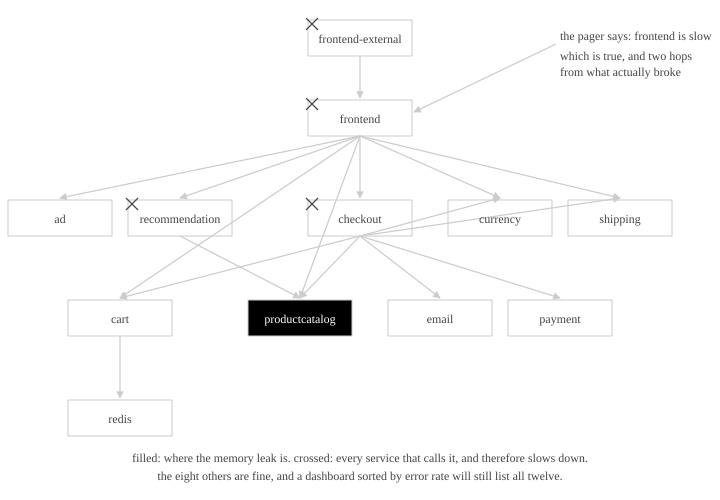
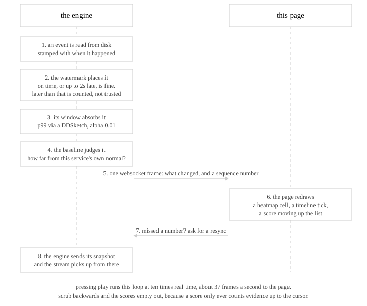
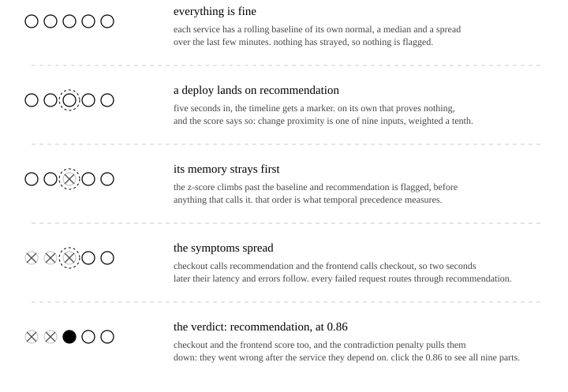
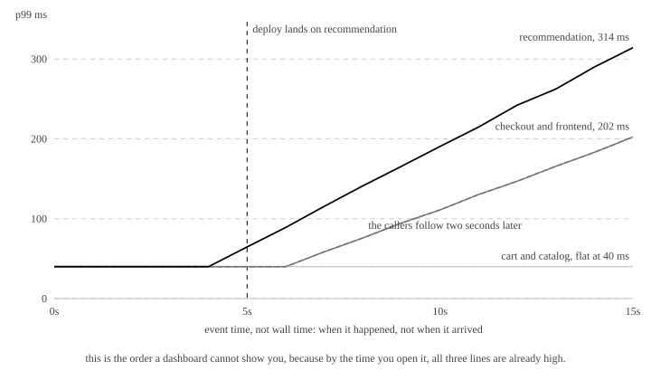
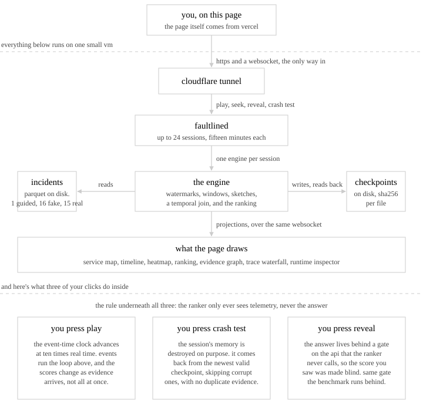
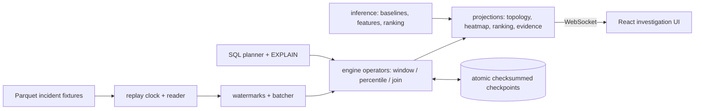
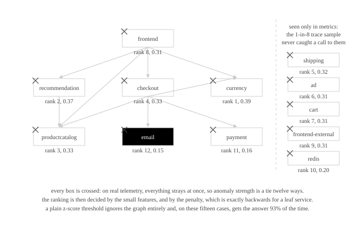
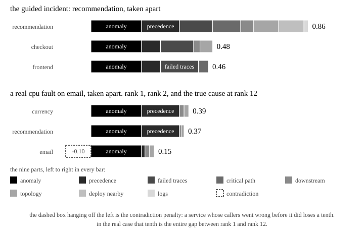

# Faultline

**Replay a cloud incident like a video. Watch evidence-ranked root causes emerge, and inspect every number behind them.**

A Rust streaming engine plus a React investigation UI for microservice incidents. Metrics, traces, logs, and deployments are replayed on one synchronized event-time clock, and every service gets a deterministic, fully decomposable root-cause score. No LLM anywhere in the inference path: a score is a fixed weighted sum of nine inspectable components tied to raw telemetry.

- Code: https://github.com/AnushSonone/faultline
- Article with the live demo embedded: https://anush.wiki/blog/faultline ("who broke checkout?")
- Every number below is reproducible from [RESULTS.md](RESULTS.md) and `scripts/run-benchmarks.sh`

## Quick start

```bash
make demo
# open http://127.0.0.1:5173 (dev harness), press Play
```

Requires Rust (`cargo`), Node.js (`npm`), and `curl`. First run installs `web/node_modules`. The product UI is the embed on the article page; the dev harness mirrors that mount against a local `faultlined` on port 8080.

What you will see on the bundled incident (`rec-mem-001`, a synthetic memory fault): a deploy marker lands, `recommendationservice` memory ramps, anomaly cells light up, downstream latency follows, and the ranking pins `recommendationservice` at 0.86 by the end of the replay, with the score breakdown, supporting and contradicting evidence, a causal evidence graph, and a healthy-vs-failed trace comparison one click away. Then press Crash test in the Runtime section and watch the session recover from an on-disk checkpoint with zero duplicate evidence.

## The problem it solves

A modern web application is dozens of services calling each other. When one of them degrades, the symptoms surface everywhere at once, and the alert usually names the service furthest from the cause, because that is the one a customer can see. Dashboards show the present; what an engineer needs during an incident is the order in which things went wrong.



The diagram is the Online Boutique call graph that the real evaluation cases come from. A leak in the product catalog (filled) slows its three callers (crossed); the pager fires for the frontend, two hops away; the eight healthy services still appear on every dashboard. Faultline does the working-backwards in the open: you can rewind, you can see every piece of evidence, and you can see exactly how it got a case wrong.

## How it works

Every metric sample, log line, trace span, and deployment carries the time it happened, not the time it arrived. Faultline sorts the whole incident onto that one event-time clock and replays it. As the clock advances, each service gets a rolling baseline of its own normal (median and MAD), anything that strays is flagged, deployments are joined against nearby anomalies, and nine features per service go into a fixed weighted sum.

### One event, start to finish

There is one loop in the engine, and everything on screen falls out of it.



| Step | Mechanism | Where |
|---|---|---|
| 1. Read | Parquet fixtures replayed in event-time order by a deterministic clock | `crates/replay` |
| 2. Watermark | Per-partition watermarks, 2 s allowed lateness, 1 s late-revision grace; later events are counted in metrics but kept out of query state | `crates/ingest` |
| 3. Window | Tumbling and hopping windows that can revise a closed window inside the grace period; latency percentiles via DDSketch at alpha 0.01 | `crates/engine` |
| 4. Baseline | Rolling median/MAD robust z-score per service with hysteresis anomaly intervals (MAD = 0 falls back to mean absolute deviation) | `crates/inference` |
| 5. Frame | One versioned WebSocket envelope per change, carrying a sequence number | `crates/projection`, `crates/api` |
| 6. Draw | Heatmap, timeline, ranking, evidence graph, trace waterfall | `web/` |
| 7-8. Resync | A sequence gap triggers a resync; the engine sends its current snapshot and the stream resumes | `crates/api` |

Two consequences worth knowing. Late data is not wrong data, so a window that already closed gets one more second to change its mind, and the UI draws the revision. An exact p99 means keeping every sample sorted, which does not fit in a stream, so each window keeps a DDSketch instead; the heatmap, the SQL engine, and the benchmark suite share that one sketch, so a query and a pixel provably agree.

### How a verdict forms

The guided incident, one row per moment. Crossed dots are services that strayed from their own baseline, the dashed halo is a deployment, the filled dot is the service ranked first.



The same fifteen seconds as the engine's own numbers, straight from the heatmap projection:



The two-second gap between `recommendationservice` leaving 40 ms and its callers following is the whole case for replay. It is the evidence that recommendation went first, and it only exists on the event-time clock.

### The score

Nine components, fixed weights (spec 18.4), a starting hypothesis rather than a tuned optimum. Every candidate's score decomposes into these in the UI, clicking a component filters the evidence list, and contradicting evidence is rendered, not suppressed.

| Component | Weight | What it measures |
|---|---|---|
| `anomaly_strength` | 0.20 | Peak robust z-score against the service's own baseline, saturated |
| `temporal_precedence` | 0.15 | Did it go wrong before the services that depend on it |
| `failed_trace_coverage` | 0.15 | Share of failed traces that pass through it |
| `critical_path_contribution` | 0.15 | Share of excess latency attributable to it on the critical path |
| `downstream_impact` | 0.10 | Share of all other services that are anomalous and reachable downstream of it |
| `topology_consistency` | 0.10 | Share of the anomalous services that its dependency paths explain |
| `change_proximity` | 0.10 | Did a deployment land just before its onset (left temporal interval join) |
| `log_evidence` | 0.05 | Correlated error logs, saturating |
| `contradiction_penalty` | -0.10 | Fraction of its impacted callers whose onset preceded its own |

A tenth feature, `persistence` (anomalous time share of the incident span), is computed and shown but carries no weight. Determinism is enforced by golden tests: same input, same bytes. Ground truth is written in each incident's labels file and served only when a request asks for it explicitly (`GET /sessions/{id}/case?reveal=true`, or `evaluation_mode: true` on load). The ranker never makes that request, and the benchmark runs with the same gate closed.

### How the pieces fit together



The page is served from the wiki; the app inside it talks over HTTPS and a WebSocket to `faultlined` behind a Cloudflare tunnel. `faultlined` holds up to 24 sessions of 15 minutes each (`FAULTLINE_MAX_SESSIONS`, `FAULTLINE_SESSION_TTL_S`), evicts sessions whose page has been gone for 60 s, auto-pauses playback nobody is watching, and serves incidents over 20,000 events precomputed (the streaming heatmap toggle returns 422 above that gate). `FAULTLINE_ALLOWED_INCIDENTS` restricts the catalog; explicit `incident_path` loads are confined to the fixtures root even without an allowlist. Trace detail and the registered-query list are scoped to the calling session, and a session's checkpoint directory is deleted when it is evicted. CORS is permissive by design: the wiki host cannot proxy a WebSocket, so the browser must reach the API directly.



## What's inside

| Layer | What it does |
|---|---|
| Event-time engine (`crates/engine`) | Watermarks with bounded out-of-orderness, tumbling/hopping windows with revision semantics, DDSketch percentiles (alpha 0.01), left temporal interval join, operator snapshot/restore |
| Inference (`crates/inference`) | Rolling median/MAD baselines, hysteresis anomaly intervals, 9 normalized root-cause features, deterministic weighted ranking, evidence objects and causal evidence graph |
| Trace analysis (`crates/graph`) | Trace DAGs, critical-path extraction (longest causally valid path), healthy-cohort matching, failed-vs-healthy diff |
| Checkpointing (`crates/state`) | Atomic versioned checkpoints (manifest-last, checksummed, LATEST pointer), corrupt-fallback recovery, no duplicate evidence after restart |
| SQL (`crates/planner`) | SQL subset (windows, percentile aggregates, one constrained temporal join) -> owned AST -> 9-node logical plan -> 6 rewrite rules -> physical plan over the same engine operators, EXPLAIN / EXPLAIN ANALYZE |
| API (`crates/api`) | Axum REST + WebSocket projections, versioned DTOs, sequence-gap resync, checkpoint/crash-test/query endpoints, session limits, the reveal gate |
| UI (`web/`) | Investigation UI shipped as an IIFE embed on the article page; `web/` holds the React source plus a dev harness that mirrors the wiki mount. Replay scrubber, Cytoscape topology and evidence graph, heatmap, trace waterfall with critical path, query-plan inspector, runtime inspector |
| Data (`python/faultline_data`) | Synthetic fixture and suite generators, RCAEval RE2-OB adapter, OTel Demo adapter |

Decision records: `docs/adr/` (21 ADRs). Milestone acceptance evidence: `docs/audits/`. Diagrams: `docs/diagrams/`.

## Results

All measured, none invented. Full tables, ablations, and the integrity block (commit, machine, seeds, raw outputs) are in [RESULTS.md](RESULTS.md).

### Synthetic suite: a smoke test

16 incidents (4 fault types x 4 target services, `generate_suite --seed 7`), labels hidden: **100% top-1**, robust to every single-feature ablation. Perfect scores here mean the generated faults are cleanly separable. This is evidence that the pipeline works, not evidence about the world.

### Real data: RCAEval RE2-OB, and a loss

15 real fault-injection cases from [RCAEval](https://arxiv.org/abs/2412.17015) (Online Boutique on a real cluster; cpu, memory, and network delay faults, one per service; traces sampled 1 in 8 by whole trace, logs capped), same untuned pipeline, run blind. Then two methods from the benchmark's own code were run on the exact same 15 cases with the same service-level scoring.

| Method | What it is | AC@1 | AC@3 | Avg@5 |
|---|---|---|---|---|
| nsigma | a plain z-score threshold on the metrics (`RCAEval.e2e.nsigma`) | **93.3%** | >= 93.3% | 0.96 |
| BARO | a published Bayesian change-point method | 13.3% | 93.3% | 0.76 |
| faultline | nine features, fixed weights, untuned | 26.7% | 46.7% | 0.41 |

A plain median/MAD z-score finds the broken service 93% of the time where the full evidence pipeline gets 27%. The loss is diagnostic: faultline already computes that same robust z-score as one of its nine features (`crates/inference/src/baseline.rs`), so the other eight are burying the signal rather than sharpening it. The rank distribution is bimodal, seven cases at rank 1-3 and eight at rank 8-12.

Here is the hard miss, with the call graph the engine reconstructed from the sampled traces and the rank it gave every service:



On real telemetry everything strays at once, so `anomaly_strength` saturates for all twelve services and the ranking is decided by the small features and the penalty. `emailservice` is a leaf that sees about one call in three hundred; its callers wobble a moment before it does, so the contradiction rule docks it the full tenth. That tenth is the entire distance between rank 1 and rank 12:



Ablations agree on which features do real work: remove `topology_consistency` and top-1 falls from 26.7% to 6.7%; remove `temporal_precedence` and it falls to 13.3%; remove `change_proximity` and nothing moves, because RCAEval has no deployment events, so a feature weighted at a tenth is structurally dead on every real case.

Caveats, stated in full in RESULTS.md: the benchmark's methods receive the injection time and compare before with after, while faultline detects onset itself; the baselines are metrics-only while faultline also weighs sampled traces and capped logs; nsigma is a helper in RCAEval's code, not one of the paper's headline baselines. The RCAEval paper's own coarse-grained RE2 numbers are for Train Ticket, not Online Boutique, and are Avg@5 (CIRCA 0.46, RCD 0.54), so they are not comparable.

The fix is written down, not built: score magnitude first, use topology and precedence as tie-breakers instead of dominant weights, re-run the same 15 cases, and report both results. Until then no accuracy number is claimed anywhere.

### Engine numbers

| Metric | p50 | p99 |
|---|---|---|
| Checkpoint write (fsync included) | 11.9 ms | 15.1 ms |
| Recovery (read and validate) | 0.42 ms | 0.76 ms |
| Duplicate projections after a forced crash | 0 | 0 |

Frontend: 98 ms time to first visual, 36.7 WebSocket frames/s during replay, 30 ms scrubber seek. Throughput and batching-speedup numbers are **withdrawn**: the previous harness took two clock readings and a `Vec::push` per chunk inside the timed loop, so at batch size 1 it was mostly timing itself, and two of its workloads never touched an engine operator. The table returns when the harness times whole passes over real operators.

## Reproducing every number

```bash
scripts/run-benchmarks.sh                                # regenerates RESULTS.md tables + integrity block

bash scripts/download-rcaeval.sh                         # pinned RCAEval-v2, ~4.2 GB, MIT
cd python && python -m faultline_data.adapters.rcaeval \
  ../datasets/raw/data/re2ob_checkoutservice_cpu_1       # convert cases
cargo run --release -p faultline-cli-bin -- evaluate \
  --dataset rcaeval-re2-ob/v2 --prefix re2ob-            # blind ranking vs labels
```

The converted RCAEval fixtures (about 100 MB) are gitignored and regenerable; a fresh clone carries only the synthetic fixtures. The demo image must therefore be built on a machine that has run the conversion.

## Development

```bash
cargo test --workspace            # 31 suites
cargo clippy --workspace --all-targets -- -D warnings
cd web && npm test                # vitest
cd web && npm run test:e2e        # Playwright specs (needs make demo running)
cd python && python -m pytest
```

See [CONTRIBUTING.md](CONTRIBUTING.md) and [docs/good-first-issues.md](docs/good-first-issues.md). The full agent contract is `Faultline_Agent_Project_Specification.txt`; milestone state is `ROADMAP.md`.

### Manual two-terminal start (macOS / Linux)

```bash
# Terminal 1 - API
export FAULTLINE_FIXTURES="$PWD/datasets/fixtures"
cargo run -p faultlined

# Terminal 2 - UI (dev harness on :5173)
cd web && npm install && npm run dev
```

To see the real product page locally, run the anush-wiki dev server (port 3000) alongside the API and open `http://127.0.0.1:3000/blog/faultline`.

### Building the embed

```bash
scripts/build-embed.sh   # tsc typecheck + vite embed build, then copies into ../anush-wiki
```

### Windows (PowerShell)

```powershell
$env:FAULTLINE_FIXTURES = "$PWD\datasets\fixtures"
cargo run -p faultlined
# second terminal: cd web; npm install; npm run dev
```

### Deploying the API

`Dockerfile` builds an API-only image (`faultlined`, no static files). Run it with the fixtures mounted and the hardening env above, behind a tunnel or reverse proxy that passes WebSockets, and point the article page's `data-api-base` at it.

## Data

- Canonical demo fixture: `datasets/fixtures/synthetic-ob/v1/rec-mem-001` (synthetic; regenerate with `python -m faultline_data.generate_fixture`)
- Evaluation suite: `python -m faultline_data.generate_suite --seed 7` (16 labeled incidents)
- Real data: RCAEval RE2-OB via `scripts/download-rcaeval.sh` + converter (audit: `docs/references/rcaeval-audit.md`)
- Demo lineup (the picker): the guided case, one eval-suite case, two real cases ranked correctly, one real near-miss at rank 2, one real hard miss at rank 12. The misses are there on purpose.

## Known limits and what's next

1. **Reranking.** Magnitude first, topology and precedence as tie-breakers, same 15 cases, both results reported. Blocks any accuracy claim.
2. **RCAEval Phase B.** All 90 RE2-OB cases with a train/test split; 15 is enough to know the pipeline loses, not enough to tune on honestly.
3. **Incremental streaming heatmap.** Today it rebuilds from every event on each publish, which wedged the server for about 70 s per publish on 155k-event cases; the 20,000-event gate is a bandage.
4. **Benchmark harness.** Whole-pass timing over real operators, so the throughput table can return.

## Claim discipline

| Say this | Not this |
|---|---|
| checkpoint recovery with idempotent incident projections | exactly-once |
| approximate p50/p95/p99 via DDSketch, alpha 0.01 | exact percentiles |
| streaming heatmap; topology, timeline, traces precomputed | fully streaming runtime |
| evidence-ranked likely causes | proven root cause |
| 26.7% top-1 untuned on 15 real cases, behind nsigma at 93.3% | competitive with baselines |
| 100% top-1 on the synthetic suite is a smoke test | evidence of real-world accuracy |

## Non-goals

Kubernetes/distributed workers, Kafka/Redis/Postgres for resume optics, LLM root-cause guessing, 3D visualization. One integrated, explainable demo beats five impressive subsystems.
