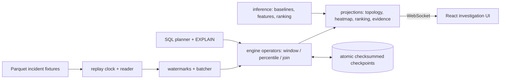

# Faultline

**Replay a cloud incident like a video. Watch evidence-ranked root causes emerge - and inspect every number behind them.**

A Rust streaming engine + React investigation UI for microservice incidents: metrics, traces, logs, and deployments replayed on one synchronized event-time clock, with deterministic, fully-decomposable root-cause ranking. No LLM in the inference path - every score is a weighted sum of ten inspectable features tied to raw telemetry.

GitHub: https://github.com/AnushSonone/faultline

## Quick start

```bash
make demo
# open http://127.0.0.1:5173, press Play
```

Requires Rust (`cargo`), Node.js (`npm`), `curl`. First run installs `web/node_modules`.

What you'll see on the bundled incident (`rec-mem-001`, synthetic memory fault): a deploy marker lands, recommendationservice memory ramps, anomaly cells light up, downstream latency follows, and the ranking pins recommendationservice at score 0.92 - with the score breakdown, supporting and contradicting evidence, a causal evidence graph, and a healthy-vs-failed trace comparison one click away. Then hit "Crash test" in the Runtime tab and watch the session recover from an on-disk checkpoint with zero duplicate evidence.

## What's inside

| Layer | What it does |
|---|---|
| Event-time engine (`crates/engine`) | Watermarks with bounded out-of-orderness, tumbling/hopping windows with revision semantics, DDSketch percentiles (alpha 0.01), left temporal interval join, operator snapshot/restore |
| Inference (`crates/inference`) | Rolling median/MAD baselines, hysteresis anomaly intervals, 10 normalized root-cause features, deterministic weighted ranking, evidence objects + causal evidence graph |
| Trace analysis (`crates/graph`) | Trace DAGs, critical-path extraction (longest causally valid path), healthy-cohort matching, failed-vs-healthy diff |
| Checkpointing (`crates/state`) | Atomic versioned checkpoints (manifest-last, checksummed, LATEST pointer), corrupt-fallback recovery, no duplicate evidence after restart |
| SQL (`crates/planner`) | SQL subset -> owned AST -> 9-node logical plan -> optimizer -> physical plan over the same engine operators, EXPLAIN / EXPLAIN ANALYZE |
| API (`crates/api`) | Axum REST + WebSocket projections, versioned DTOs, sequence-gap resync, checkpoint/crash-test/query endpoints |
| UI (`web/`) | 4-tab investigation shell, replay scrubber, Cytoscape topology + evidence graph, heatmap, trace waterfall with critical path, query-plan inspector |

## Architecture



Decision records: `docs/adr/` (21 ADRs). Milestone acceptance evidence: `docs/audits/`.

## Numbers (reproducible)

All measured, none invented - see [RESULTS.md](RESULTS.md) for full tables and the integrity block (commit, machine, seeds, raw outputs). Highlights: 100% top-1 on the 16-incident synthetic suite (a smoke test, labeled as such); **26.7% top-1 / 0.41 MRR untuned and train-free on 15 real RCAEval RE2-OB cases**, with ablations showing topology consistency and temporal precedence carry real-data ranking; 5-15x batch-vs-row speedups on filter/aggregate/percentile paths (and an honest ~1x on the join); 13 ms checkpoint writes, sub-millisecond recovery reads, zero duplicate evidence after forced crashes; 98 ms UI time-to-first-visual. Reproduce with `scripts/run-benchmarks.sh`.

Claim discipline: percentiles are DDSketch approximations; recovery is "checkpoint recovery with idempotent incident projections," never exactly-once; synthetic and real datasets are always labeled as such.

## Evaluation on real incident data

```bash
bash scripts/download-rcaeval.sh                         # pinned RCAEval-v2, ~4.2 GB, MIT
cd python && python -m faultline_data.adapters.rcaeval \
  ../datasets/raw/data/re2ob_checkoutservice_cpu_1       # convert cases
cargo run --release -p faultline-cli-bin -- evaluate \
  --dataset rcaeval-re2-ob/v2 --prefix re2ob-            # blind ranking vs labels
```

## Development

```bash
cargo test --workspace            # 31 suites
cargo clippy --workspace --all-targets
cd web && npm run test:e2e        # 7 Playwright specs (needs make demo running)
cd python && python -m pytest
```

See [CONTRIBUTING.md](CONTRIBUTING.md) and [docs/good-first-issues.md](docs/good-first-issues.md). The full agent contract is `Faultline_Agent_Project_Specification.txt`; milestone state is `ROADMAP.md`.

### Manual two-terminal start (macOS / Linux)

```bash
# Terminal 1 - API
export FAULTLINE_FIXTURES="$PWD/datasets/fixtures"
cargo run -p faultlined

# Terminal 2 - UI
cd web && npm install && npm run dev
```

### Windows (PowerShell)

```powershell
$env:FAULTLINE_FIXTURES = "$PWD\datasets\fixtures"
cargo run -p faultlined
# second terminal: cd web; npm install; npm run dev
```

## Data

- Canonical demo fixture: `datasets/fixtures/synthetic-ob/v1/rec-mem-001` (synthetic; regenerate with `python -m faultline_data.generate_fixture`)
- Evaluation suite: `python -m faultline_data.generate_suite --seed 7` (16 labeled incidents)
- Real data: RCAEval RE2-OB via `scripts/download-rcaeval.sh` + converter (audit: `docs/references/rcaeval-audit.md`)

## Non-goals

Kubernetes/distributed workers, Kafka/Redis/Postgres for resume optics, LLM root-cause guessing, 3D visualization. One integrated, explainable demo beats five impressive subsystems.
